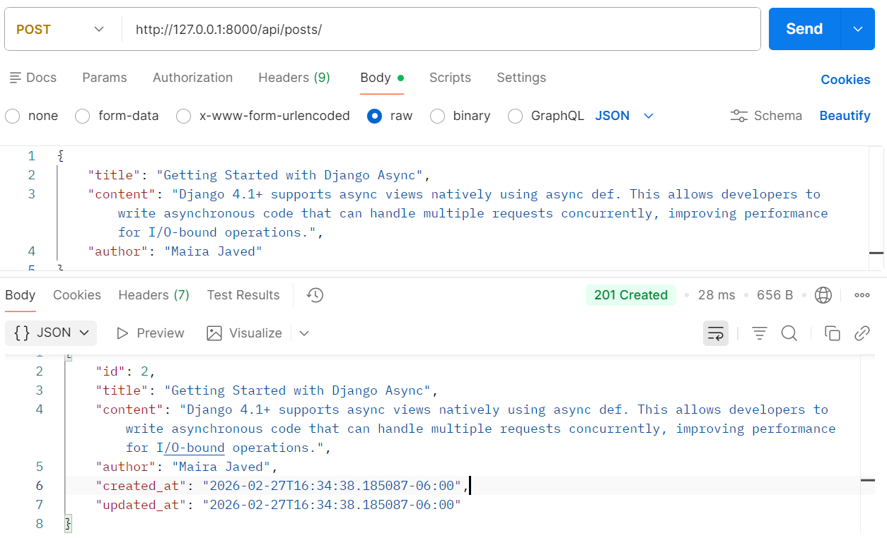
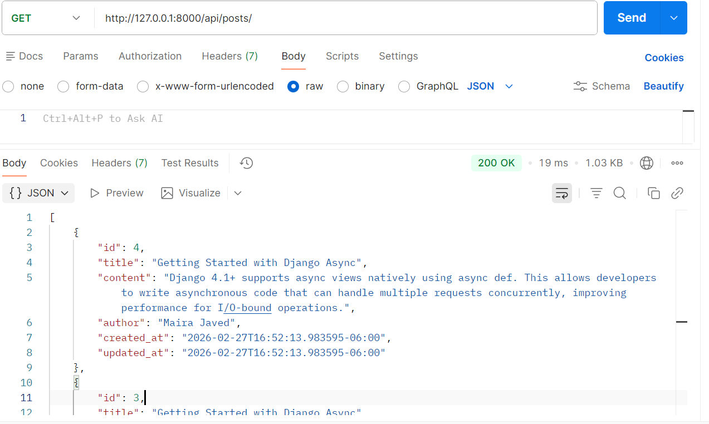
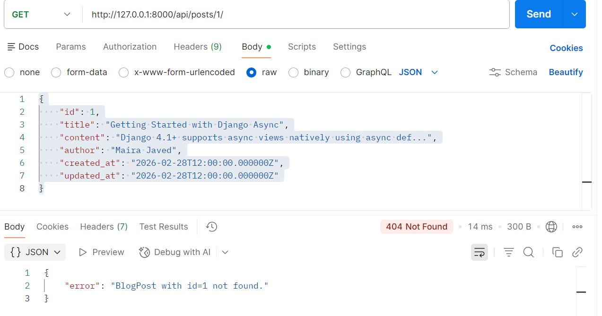
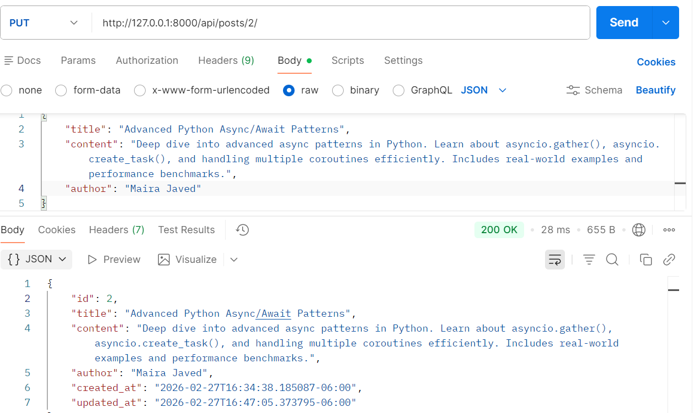
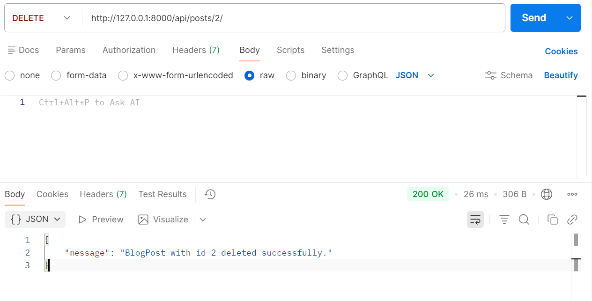
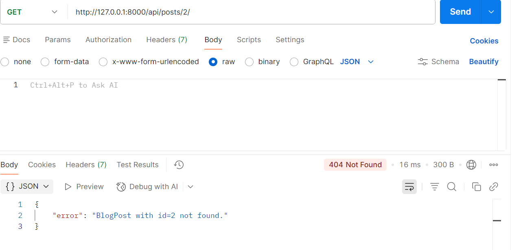

# Async Blog Post CRUD API

A fully **async** REST API built with **Django 4.2+** and **Django REST Framework**, using Django's native async ORM methods (`aget`, `acreate`, `asave`, `adelete`).

---

## Tech Stack

| Layer       | Technology                    |
|-------------|-------------------------------|
| Framework   | Django 4.2+                   |
| API Layer   | Django REST Framework 3.14+   |
| Database    | SQLite (default) / PostgreSQL |
| Server      | Uvicorn (ASGI) or Daphne      |

---

## Project Structure

```
blog_api/
├── blog_api/
│   ├── __init__.py
│   ├── settings.py
│   ├── urls.py
│   └── asgi.py
├── posts/
│   ├── __init__.py
│   ├── apps.py
│   ├── models.py
│   ├── serializers.py
│   ├── views.py
│   └── urls.py
├── manage.py
├── requirements.txt
└── README.md
```

---

## Setup Instructions

### 1. Clone the repository

```bash
git clone https://github.com/21108130/blog_api_project.git
cd blog-api
```

### 2. Create and activate a virtual environment

```bash
python -m venv venv
source venv/bin/activate        # macOS/Linux
venv\Scripts\activate           # Windows
```

### 3. Install dependencies

```bash
pip install -r requirements.txt
```

### 4. Apply migrations

```bash
python manage.py migrate
```

### 5. Run the development server (ASGI for async support)

```bash
# Install uvicorn
pip install uvicorn

# Run with uvicorn (recommended for async)
uvicorn blog_api.asgi:application --reload --port 8000

# Or use Django's built-in dev server (also works for testing)
python manage.py runserver
```

---

## API Endpoints

| Method | Endpoint            | Description          |
|--------|---------------------|----------------------|
| POST   | `/api/posts/`       | Create a blog post   |
| GET    | `/api/posts/`       | Get all blog posts   |
| GET    | `/api/posts/<id>/`  | Get a single post    |
| PUT    | `/api/posts/<id>/`  | Update a blog post   |
| DELETE | `/api/posts/<id>/`  | Delete a blog post   |

---

## Example API Responses

### POST `/api/posts/` — Create a Blog Post

**Request Body:**
```json
{
    "title": "Getting Started with Django Async",
    "content": "Django 4.1+ supports async views natively using async def. This allows developers to write asynchronous code that can handle multiple requests concurrently, improving performance for I/O-bound operations.",
    "author": "Maira Javed"
}
```

**Response `201 Created`:**
```json
{
    "id": 2,
    "title": "Getting Started with Django Async",
    "content": "Django 4.1+ supports async views natively using async def. This allows developers to write asynchronous code that can handle multiple requests concurrently, improving performance for I/O-bound operations.",
    "author": "Maira Javed",
    "created_at": "2026-02-27T16:34:38.185087-06:00",
    "updated_at": "2026-02-27T16:34:38.185087-06:00"
}

```

---

### GET `/api/posts/` — List All Blog Posts

**Response `200 OK`:**
```json
[
    {
        "id": 4,
        "title": "Getting Started with Django Async",
        "content": "Django 4.1+ supports async views natively using async def. This allows developers to write asynchronous code that can handle multiple requests concurrently, improving performance for I/O-bound operations.",
        "author": "Maira Javed",
        "created_at": "2026-02-27T16:52:13.983595-06:00",
        "updated_at": "2026-02-27T16:52:13.983595-06:00"
    },
    {
        "id": 3,
        "title": "Getting Started with Django Async",
        "content": "Django 4.1+ supports async views natively using async def. This allows developers to write asynchronous code that can handle multiple requests concurrently, improving performance for I/O-bound operations.",
        "author": "Maira Javed",
        "created_at": "2026-02-27T16:43:23.692950-06:00",
        "updated_at": "2026-02-27T16:43:23.692950-06:00"
    }
]

```

---

### GET `/api/posts/1/` — Get a Single Blog Post

**Response `200 OK`:**
```json
{
    "id": 1,
    "title": "Getting Started with Django Async",
    "content": "Django 4.1+ supports async views natively using async def...",
    "author": "Maira Javed",
    "created_at": "2026-02-28T12:00:00.000000Z",
    "updated_at": "2026-02-28T12:00:00.000000Z"
}
```

**Response `404 Not Found`:**
```json
{
    "error": "BlogPost with id=99 not found."
}
```

---

### PUT `/api/posts/1/` — Update a Blog Post

**Request Body:**
```json
{
    "title": "Advanced Python Async/Await Patterns",
    "content": "Deep dive into advanced async patterns in Python. Learn about asyncio.gather(), asyncio.create_task(), and handling multiple coroutines efficiently. Includes real-world examples and performance benchmarks.",
    "author": "Maira Javed"
}
```

**Response `200 OK`:**
```json
{
    "id": 2,
    "title": "Advanced Python Async/Await Patterns",
    "content": "Deep dive into advanced async patterns in Python. Learn about asyncio.gather(), asyncio.create_task(), and handling multiple coroutines efficiently. Includes real-world examples and performance benchmarks.",
    "author": "Maira Javed",
    "created_at": "2026-02-27T16:34:38.185087-06:00",
    "updated_at": "2026-02-27T16:47:05.373795-06:00"
}
```


---

### DELETE `/api/posts/1/` — Delete a Blog Post

**Response `200 OK`:**
```json
{
    "message": "BlogPost with id=1 deleted successfully."
}
```



---

## Validation Errors

When required fields are missing or blank:

**Response `400 Bad Request`:**
```json
{
    "errors": {
        "title": ["This field is required."],
        "content": ["This field is required."]
    }
}


```


---

## HTTP Status Codes

| Code | Meaning                          |
|------|----------------------------------|
| 200  | OK — successful GET / PUT / DELETE |
| 201  | Created — successful POST        |
| 400  | Bad Request — validation error   |
| 404  | Not Found — post doesn't exist   |

---

## Async Implementation Notes

All views use `async def` and Django's async ORM methods:

| ORM Method           | Used For            |
|----------------------|---------------------|
| `BlogPost.objects.all()` with `async for` | List all posts |
| `BlogPost.objects.acreate()` | Create a post   |
| `BlogPost.objects.aget(pk=pk)` | Fetch single post |
| `post.asave()`       | Update a post       |
| `post.adelete()`     | Delete a post       |

---

## Running Tests

```bash
python manage.py test posts


---

